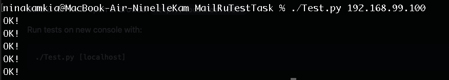

# Key-Value storage Tarantool

### Configure:
[config](https://github.com/tarantool/http)

### Build:
- Download tarantool [here](https://www.tarantool.io/ru/)
- Download Docker if you haven't docker on your machine [here](https://www.docker.com/products/docker-desktop)

### Run:
```
docker build . -t mytarantool
docker run -p 8888:8888 --name mytarantool -t mytarantool
```
After this, you have available to `http://localhost:8888` , where `localhost` is IP by your docker deamon

If you suddenly forgot how to delete a container in docker:
```
- docker ps
- docker stop [id_conteiner]
- docker rm [id_conteiner]
```

### Tests:
Before run tests open at browser `http://localhost:8888`

Run tests on new console with:
```
./Test.py [localhost]
```
​

### Api:
- POST /kv body: {key: "test", "value": {SOME ARBITRARY JSON}}
- PUT kv/{id} body: {"value": {SOME ARBITRARY JSON}}
- GET kv/{id}
- DELETE kv/{id}

-----------------------------------------------------------------------------

- POST возвращает 409 если ключ уже существует,
- POST, PUT возвращают 400 если боди некорректное
- PUT, GET, DELETE возвращает 404 если такого ключа нет - все операции логируются

### About Key Value Storage:
To start a server with a router:

- Create a server with `server = require('http.server').new(...)`.
- Create a router with `router = require('http.router').new(...)`.
- Set a router to server with `server:set_router(router)`.
- Configure routing with router:route(...).
- Start serving HTTP requests it with `server:start()`.
	- To stop the server, use `server:stop()`.